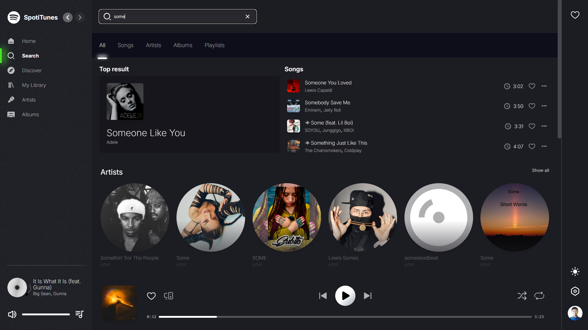
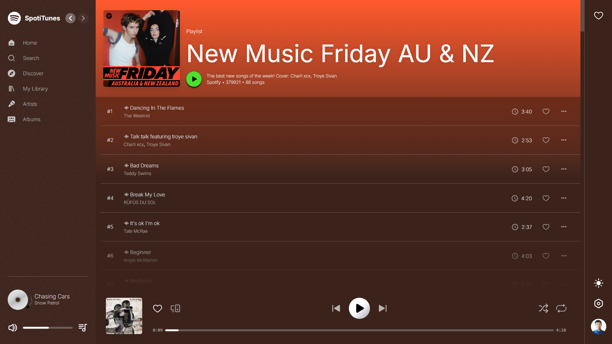
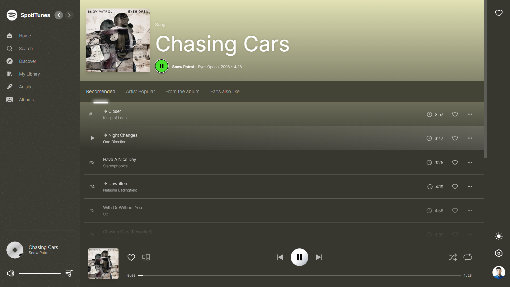

## React + Tailwind CSS + Spotify API = SpotiTunes

SpotiTunes [https://spotitunes.vercel.app](https://spotitunes.vercel.app), wrote in React with love.

## Tech stack

-   React
-   Typescript
-   Tailwind CSS
-   Spotify API
-   Zustand
-   React Query

All icons are from `react-icons`. No third party UI Component libarary is used, purely based on `Tailwind CSS`.

## Features

-   Pages
    -   ☑️ Home
    -   ☑️ Search
    -   ☑️ Favorite
    -   ☑️ Playlist
    -   ☑️ Artist
    -   ☑️ Album
    -   ☑️ Track
-   UI
    -   ☑️ Dark mode
    -   🔲 Light mode
    -   ☑️ Dynamic theme color
    -   ☑️ Loading skeletons
    -   ☑️ Page header font size auto adjustment
-   Player
    -   ☑️ Player control
    -   ☑️ Play track previews for non-premium users
    -   ☑️ Play full track for premium users using web play API
    -   🔲 Current playback queue
    -   🔲 Shuffle playback queue
    -   🔲 Picture-in-picture
-   Interactions
    -   🔲 Follow artist
    -   🔲 Add playlist to favorite
    -   🔲 Add track to favorite list

### Screenshots

